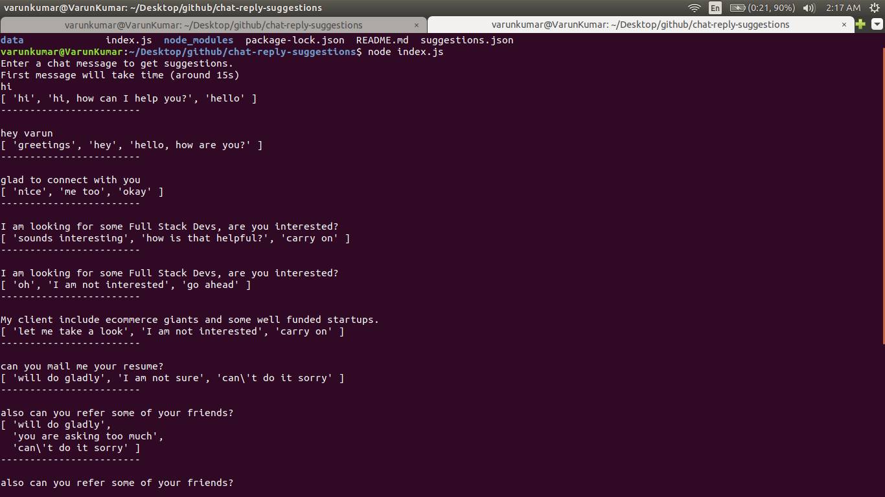

# chat-reply-suggestions
Auto reply suggestions to chat messages/emails built using rasa_nlu framework.

### How to install and train chatbot

1. Make sure you have git, python, virtualenv and npm installed
2. Clone the repository `git clone https://github.com/varunon9/chat-reply-suggestions.git`
3. Go to project directory `cd chat-reply-suggestions/`
4. Create a virtual environment `virtualenv venv`
5. Activate virtual environment `source venv/bin/activate`
6. Install Rasa NLU as well as spacy `pip install rasa_nlu[spacy] --default-timeout=100`
7. Install language model for the english language `python -m spacy download en_core_web_md`
8. Link to model data `python -m spacy link en_core_web_md en`
9. Install some additional dependencies `pip install -r requirements.txt`
10. Place your nlu_data.json file inside data directory (a sample file is provided).
11. Train the intent models using below command 
12. `python -m rasa_nlu.train --config config_spacy.yml --data data/nlu_data.json --path projects`
13. Install node dependencies `npm install`
14. Start nlu server in current terminal `python -m rasa_nlu.server --path projects`
15. Open another terminal in same project directory (no need to activate virtual environment)
16. Start the app `node index.js`

### How to improve efficiency

- The above app uses sample data (collected by me) for demo. Bot can be made more efficient by 
  training with more real world data.
- Currently suggestions are bunch of hardcoded arrays based on intent. Entity recognition can be 
  done and suggestions can be generated on the fly.

## Screenshots
|  |
| --- |
| |

#### To see working demo on youtube watch this video:
* https://youtu.be/MCBmbJyoamY

###### For query/issues create Github issue or contact: varunon9@gmail.com  